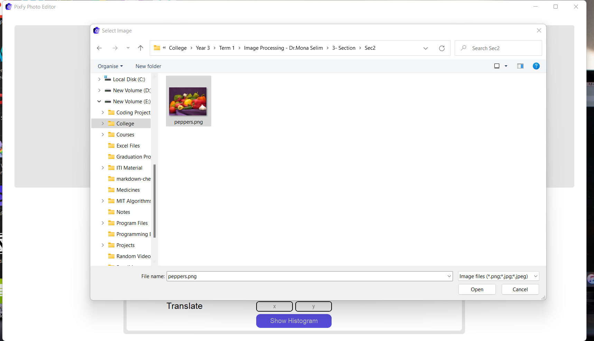

<!-- PROJECT LOGO -->
<br />
<div align="center">
  <a href="https://github.com/mohamedsaeed138/PixFy_Desktop_Photo_Editor">
    
  </a>
  <h3 align="center">PixFy</h3>
  <p align="center">
   <i>A Desktop Photo Editor using python and customtkinter following the MVP Model-View-Presenter Architectural Pattern</i></p>
</div>
<!-- PROJECT Badges -->
<div align="center">
  <a href="https://github.com/mohamedsaeed138/PixFy_Desktop_Photo_Editor/stargazers"></a>
<a href="https://github.com/mohamedsaeed138/PixFy_Desktop_Photo_Editor/network/members"></a>
<a href="https://github.com/mohamedsaeed138/PixFy_Desktop_Photo_Editor/pulls"></a>
<a href="https://github.com/mohamedsaeed138/PixFy_Desktop_Photo_Editor/issues"></a>
<a href="https://github.com/mohamedsaeed138/PixFy_Desktop_Photo_Editor/graphs/contributors"></a>
<a href="https://github.com/mohamedsaeed138/PixFy_Desktop_Photo_Editor/blob/main/LICENSE.txt"></a>
</div>
<!-- ABOUT THE PROJECT -->

## Overview


This is a desktop photo editor application built using Python, following the Model-View-Presenter (MVP) architectural pattern. It provides a minimal set of features aimed at demonstrating the core functionality of the application. The user interface is developed with custom-tkinter library, and the application utilizes the open-cv and Pillow libraries for image processing and manipulation.The project was created for a college image processing course.

## Features

* Responsive Design App
* Light & Dark Modes

### Basic Image Editing Tools

* Box Filter
* Canny Edge Detection
* Composite Laplacian Sharpening
* Contrast Stretching
* Equalization
* Gaussian Filter
* Gaussian Noise
* GrayScale Filter
* Histogram Analysis
* Laplacian Sharpening
* Log Transform
* Max Filter
* Mean Filter
* Median Filter
* Min Filter
* Negative Effect
* Power Law Transformation
* Resizing
* Rotation (190 Degrees)
* Salt & Pepper Noise Generation
* Sobel Edge Detection (X, Y, XY)
* Threshold
* Translation

## Screenshots

* The App intro in light mode 
* The App intro in dark mode 
* The main screen in light mode 
* Here i enabled the dark mode theme 
* You can upload an image using the file dialog or drag and drop 
* Here After uploading the image 
* Here i rotated the image with 190 degree 
* Here i resized the image 
* You can display the histogram of the image but first enable the gray scale filter from Gray Filters tab 
* Here i applied the gray scale filter 
* Here i applied the negative filter 
* Here i smoothed the image using Box Filter 
* Here i sharpened the image using Composite Laplacian Filter 
* You can add some Salt & Paper noise or Gaussian Noise 
* Here i used canny method for image segmentation, also you can use Sobel method 
* After you finish editing ,you can save the image as png or jpg 

<!-- GETTING STARTED -->
## Getting Started

### Installation

1. Clone the repo

   ```sh
   git clone https://github.com/mohamedsaeed138/PixFy_Desktop_Photo_Editor.git
   ```

2. Install dependencies

   ```sh
   pip install -r requirements.txt
   ```
<!-- USAGE EXAMPLES -->
## Usage

1. Navigate to the project directory.
2. Run the application using

```sh
python main.py
```

## Model-View-Presenter (MVP) Architecture

This application follows the Model-View-Presenter architectural pattern:

* Model: Represents the data and business logic.
* View: Presents the data to the user and handles user interactions.
* Presenter: Acts as an intermediary between the model and the view, handling business logic and updating the view.
<!-- CONTRIBUTING -->
## Contributing

Contributions are what make the open source community such an amazing place to learn, inspire, and create. Any contributions you make are **greatly appreciated**.

If you have a suggestion that would make this better, please fork the repo and create a pull request. You can also simply open an issue with the tag "enhancement".
Don't forget to give the project a star! Thanks again!

1. Fork the Project
2. Create your Feature Branch (`git checkout -b feature/new-feature`)
3. Commit your Changes (`git commit -m 'Add some new-feature'`)
4. Push to the Branch (`git push origin feature/new-feature`)
5. Open a Pull Request
<!-- LICENSE -->
## License

Distributed under the MIT License. See [LICENSE](LICENSE.txt) for more information.
<!-- MARKDOWN LINKS & IMAGES -->
<!-- https://www.markdownguide.org/basic-syntax/#reference-style-links -->